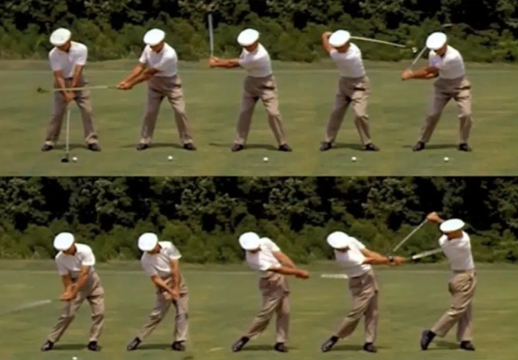

## Introduction

Consider a Golf player in the initial swing movement. The movement involves feet, legs, upper body, and a characteristic arm swing to make the club hit the ball (such that it reaches as close as possible to a given target (usually a hole in a green)). Figure 1 shows the chained sequence of movements that forms the swing.

The swing movement, the shape of the club, the speed at which the player’s body moves, all of them are critical to transmit to the ball the adequate force/torque.

# Tasks

**Task 1** – Develop a MuJoCo XML model for the ensemble Golf player+club.

List any simplifications/assumptions made and their potential impact in the realism of the simulation.

In your answer/solution, ensure that the XML MuJoCo model is duly commented and any additional files, e.g., STL files which allow for realistic renderings, are provided.

**Task 2** – Design a set of tests that can be run under either the Simulate App in the MuJoCo software or using the Python environment, to show how realistic the model is. Run the simulation on these tests. Consider the existence of disturbances in each degree-of-freedom (dof), e.g., the wrist of the player being shaky.

**Task 3** – Write a short (one A4 page max) comment on the results obtained. Emphasize the good points of your results but do not hide the rest!